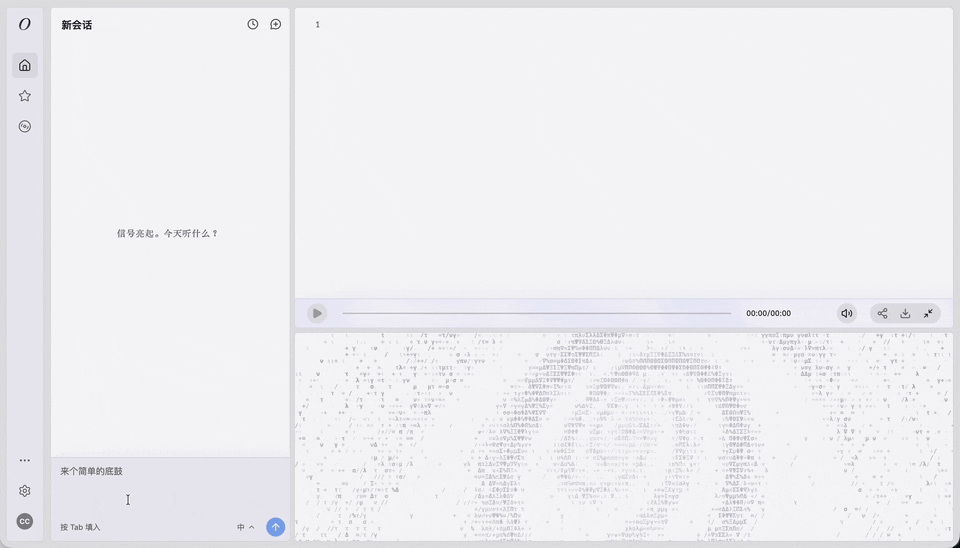

<!-- README-I18N:START -->

[中文](./README.md) | **English**

<!-- README-I18N:END -->

<div align="center">

<picture>
  <source media="(prefers-color-scheme: dark)" srcset="logo/oddenova-logo-dark.png" />
  <source media="(prefers-color-scheme: light)" srcset="logo/oddenova-logo-light.png" />
  
</picture>

## **Start now — vibe a track of your own**

[](https://react.dev)
[](https://www.typescriptlang.org)
[](https://vite.dev)
[](LICENSE)
[](https://github.com/yiichuan/oddeNova/actions/workflows/ci.yml)

**[Try it now → www.oddenova.com](https://www.oddenova.com)**

[How You Interact](#how-you-interact) • [Local Quick Start](#local-quick-start) • [How It Works](#how-it-works) • [Project Structure](#project-structure)

</div>

---

oddeNova is an【Agent for improvised music-making】. Talk to it, and build the music you want step by step.

**Like vibe coding, but for music**

<picture>
  <source media="(prefers-color-scheme: dark)" srcset="docs/images/oddenova-demo-dark.gif" />
  <source media="(prefers-color-scheme: light)" srcset="docs/images/oddenova-demo-light.gif" />
  
</picture>

## For Whom

For creators who care about music
Whether you are scoring your own work, or the music is the work itself
Whether you have no arrangement knowledge and have never opened a DAW, or know all of it by heart

You are tired of formulaic template "hits", tired of gacha-style AI music
You want the rhythm, the notes, the chords to be entirely part of what you are saying


## How You Interact

Talk to oddeNova to generate and adjust the music, or edit the Strudel code driving playback yourself
Your ideas and your choices are what the work is made of


**Core Creation Experience**

- **Natural language composition** — Describe your ideas and your notes; keep iterating on the result
- **Layered track management** — Drums, strings, synths and more, each an independent layer you can manage in detail
- **Precise iterative editing** — From the whole track down to a single note, all through conversation
- **Instant playback** — Code runs in the browser the moment it is generated, and updates splice in seamlessly
- **WAV export** — Once a demo sounds right, export it as a WAV file

**AI & Interaction**

- **Composition in stages** — The Agent never drops a finished track on you at once; it builds the layers up from simple to complex, the way writing music actually goes
- **Visible thinking** — The reasoning stays on screen, so you can see at a glance how the Agent structures a section in code
- **Arrangement suggestions** — Next-step suggestions offered automatically from the current context
- **Multiple LLM providers** — DeepSeek, OpenAI, Claude and GLM, switchable in Settings

**Session & History**

- **Multi-session management** — Create and switch between multiple independent music creation sessions
- **Session replay** — Every stage of the work is kept; switch back to any of them at any time
- **Undo** — Roll back to any historical version (up to 50 steps)
- **Share link** — Generate a shareable URL to share your creation in one click

**UI & Other**

- **Code panel** — Syntax-highlighted Strudel code in real time, editable right where it sits
- **Animation panel** — VJ visuals themed to the release, moving with the groove while a track plays
- **Featured page** — A collection of tracks recreated in Strudel
- **Mobile-friendly** — The full experience works in a phone browser too
- **Learn Strudel** — Strudel is a JS-based language for live music playback: powerful, and easy to pick up. oddeNova links to a full tutorial.

## Local Quick Start

### Requirements

- Node.js >= 18
- API key from any of the following AI providers (optional):
  - [DeepSeek](https://platform.deepseek.com/)
  - [OpenAI](https://platform.openai.com/)
  - [Anthropic](https://console.anthropic.com/) (Claude)
  - [GLM](https://open.bigmodel.cn/)

### Installation & Running

```bash
git clone https://github.com/yiichuan/oddeNova.git
cd oddeNova
npm install
npm run dev
```

Open your browser at `http://localhost:5173`. On first use, select a provider and enter your API key in the dialog to start creating.

### Available Scripts

| Command | Description |
|---------|-------------|
| `npm run dev` | Start the Vite dev server |
| `npm run build` | Type-check + production build |
| `npm run preview` | Preview production build |
| `npm run lint` | ESLint code check |
| `npm test` | Run unit tests (Vitest) |

## How It Works

Every text message you send triggers an AI Agent inference loop:

```
User text input
    ↓
AI Agent (multi-round tool call loop, up to 30 rounds)
    ├── setCode(code)             Write or modify the complete Strudel code
    ├── validate(code)            Validate code syntax and runtime
    └── commit(explanation)       Commit final code and play
    ↓
Strudel engine executes → Browser WebAudio playback
```

The Agent manages the complete Strudel code directly via `setCode`. Each conversation writes a new version, which is validated with `validate`, and finally `commit` triggers a hot-reload. Track layers are marked with `/* @layer NAME */` comments inside the code, enabling structured incremental editing.

**Anyone can get started — no music theory or coding knowledge required:**

**Beginner-friendly · Describe in your most natural language**

> "I want some relaxing background music"
> "Add something upbeat, like the vibe of a lazy afternoon coffee"
> "A simple drum part"
> "Faster rhythm, brighter sound"

**Advanced users · Precise control over every detail**

> "Give me a lo-fi drum beat with bass, BPM 90, and some vinyl noise"
> "Add a synth melody, more ambient, using a Fender Rhodes tone"
> "Swap the snare for something more trap, add 808 bass"
> "Shift everything to A minor, bump the tempo to 140"

## Tech Stack

| Layer | Technology |
|-------|------------|
| Frontend framework | React 19 + TypeScript |
| Build tool | Vite |
| Styling | Tailwind CSS v4 |
| Code editor | CodeMirror 6 |
| Audio engine | [Strudel](https://strudel.cc/) + superdough (WebAudio API) |
| AI models | DeepSeek / Kimi / OpenAI / Claude / GLM, switch freely in UI |
| Data persistence | IndexedDB (session storage) |
| Testing | Vitest |
| Deployment | Vercel (with Serverless Functions) |

## System Architecture

```
┌─────────────────────────────────────────────────────┐
│                      Browser                        │
│                                                     │
│  ┌──────────┐  ┌──────────────┐  ┌──────────────┐  │
│  │ History  │  │  Chat / UI   │  │  Code Panel  │  │
│  │  Panel   │  │  (React 19)  │  │ (CodeMirror) │  │
│  └──────────┘  └──────┬───────┘  └──────────────┘  │
│                        │                            │
│               ┌────────▼────────┐                   │
│               │   Agent Loop    │                   │
│               │  loop.ts        │                   │
│               │  executor.ts    │                   │
│               │  tools.ts       │                   │
│               └────────┬────────┘                   │
│                        │ tool calls                 │
│    ┌───────────────────┼───────────────────┐        │
│    ▼                   ▼                   ▼        │
│         setCode()    validate()    commit()         │
│    └───────────────────┬───────────────────┘        │
│                        │ final code                 │
│               ┌────────▼────────┐                   │
│               │  Strudel Engine │                   │
│               │  (WebAudio API) │                   │
│               └─────────────────┘                   │
│                                                     │
│  ── LLM API (DeepSeek / Kimi / OpenAI / Claude) ── │
│  ── IndexedDB (session + undo history) ─────────── │
└─────────────────────────────────────────────────────┘
```

See [docs/frontend-architecture.md](docs/frontend-architecture.md) for details.

## Project Structure

```
src/
├── App.tsx                  # Main application component
├── agent/
│   ├── tools.ts             # Agent tool definitions (3 tools)
│   ├── executor.ts          # Tool executor
│   ├── loop.ts              # Agent inference loop (up to 30 rounds)
│   └── parser.ts            # Strudel code parsing (layer extraction)
├── components/              # UI components
│   ├── ChatInput.tsx        # Text input
│   ├── CodePanel.tsx        # Code editor + WAV export
│   ├── ConversationView.tsx # Conversation history + agent reasoning display
│   ├── HistoryPanel.tsx     # Session browser + replay controls
│   └── ...
├── hooks/
│   ├── useSessions.ts       # Session state management (IndexedDB)
│   ├── useReplay.ts         # Session replay
│   ├── useSuggestions.ts    # AI suggestion generation
│   └── useStrudel.ts        # Strudel audio engine management
├── services/
│   ├── llm.ts               # LLM API calls (dual protocol: Anthropic + OpenAI)
│   ├── llm-config.ts        # Multi-provider configuration and routing
│   ├── share.ts             # Share link generation
│   └── strudel.ts           # Strudel engine wrapper and validation
├── demo/                    # Demo mode configuration and LLM simulation
└── prompts/
    ├── active.ts            # Pointer to current active prompt version
    └── versions/            # Versioned prompts (append-only)
```

## License

[AGPL-3.0](LICENSE) (required by the Strudel dependency license)
