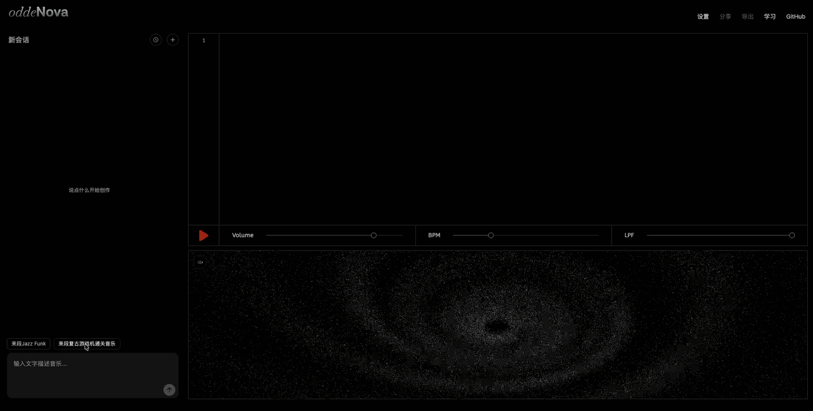

<!-- README-I18N:START -->

**中文** | [English](./README.en.md)

<!-- README-I18N:END -->

<div align="center">


## **你的即兴音乐创作空间**

[](https://react.dev)
[](https://www.typescriptlang.org)
[](https://vite.dev)
[](LICENSE)
[](https://github.com/yiichuan/oddeNova/actions/workflows/ci.yml)

**[立即体验 → www.oddenova.com](https://www.oddenova.com)**

[功能特色](#功能特色) • [快速开始](#快速开始) • [工作原理](#工作原理) • [项目结构](#项目结构)

</div>

---

oddeNova 是面向创作者的即兴音乐创作 Agent 平台。用一句话描述感觉、主题或画面，AI Agent 将其拆解为可见的音轨层，你在「听—判断—修改」的循环中，把音乐一步步做出来。

**不是一键生成器——是你参与完整创作过程的私密空间。**



## 为谁而生

有表达欲和审美判断，但暂时缺少乐理、编曲或电子乐工具经验——  
脑中有画面、情绪或主题，能感知音乐是否符合自己的感觉，  
愿意参与修改和迭代，而不满足于随机抽卡式的生成结果。

## 功能特色

描述感觉，调整结构，直到作品真正长出来。

**核心创作体验**

- **自然语言编曲** — 直接描述音乐意图，无需了解任何代码或乐理
- **分层音轨管理** — 底鼓、军鼓、贝斯、合成器等各自作为独立 layer，可按需增删替换
- **精准迭代编辑** — 每次对话只修改涉及的 layer，其余轨道保持原样
- **即时播放** — 代码生成后立即在浏览器中执行播放，无需后端服务
- **WAV 导出** — 通过 OfflineAudioContext 渲染并下载 WAV 音频文件

**AI 与交互**

- **思考过程可见** — 侧边栏实时展示 Agent 的推理过程与工具调用
- **AI 智能建议** — 根据当前音乐上下文自动生成下一步操作建议
- **多 LLM 服务商** — 支持 DeepSeek、Kimi、OpenAI、Claude、GLM（智谱），可在界面中随时切换

**会话与历史**

- **多 Session 管理** — 创建并随时切换多个独立的音乐创作会话
- **Session 回放** — 逐步回放任意历史会话的创作过程
- **撤销功能** — 支持回退至任意历史版本（最多 50 步）
- **分享链接** — 生成可分享的 URL，一键分享你的创作

**界面与其他**

- **代码面板** — 实时展示带语法高亮的 Strudel 代码，支持直接编辑
- **移动端适配** — 三栏布局在手机上自动切换为单栏抽屉式布局
- **Demo 模式** — URL 附加 `?demo=true` 进入预设演示流程，无需 API Key

## 快速开始

### 环境要求

- Node.js >= 18
- 以下任一 AI 服务商的 API Key（可选）：
  - [DeepSeek](https://platform.deepseek.com/)
  - [Kimi (Moonshot)](https://platform.moonshot.cn/)
  - [OpenAI](https://platform.openai.com/)
  - [Anthropic](https://console.anthropic.com/)（Claude）
  - [GLM（智谱）](https://open.bigmodel.cn/)

### 安装与运行

```bash
git clone https://github.com/yiichuan/oddeNova.git
cd oddeNova
npm install
npm run dev
```

打开浏览器访问 `http://localhost:5173`，首次使用时在弹窗中选择服务商并填写对应的 API Key 即可开始创作。

### 可用脚本

| 命令 | 说明 |
|------|------|
| `npm run dev` | 启动 Vite 开发服务器 |
| `npm run build` | 类型检查 + 生产环境构建 |
| `npm run preview` | 预览生产构建产物 |
| `npm run lint` | ESLint 代码检查 |
| `npm test` | 运行单元测试（Vitest） |

### 一键部署到 Vercel

[](https://vercel.com/new/clone?repository-url=https%3A%2F%2Fgithub.com%2Fyiichuan%2FoddeNova)

> API Key 在应用内界面填写，无需配置服务器环境变量。如需 cron 清理功能，在 Vercel 项目设置中配置 `CRON_SECRET`。

## 工作原理

你输入的每一条文字都会触发一个 AI Agent 推理循环：

```
用户文字输入
    ↓
AI Agent（多轮工具调用循环，最多 30 轮）
    ├── setCode(code)             编写或修改完整 Strudel 代码
    ├── validate(code)            验证代码语法与运行时
    └── commit(explanation)       提交最终代码并播放
    ↓
Strudel 引擎执行 → 浏览器 WebAudio 播放
```

Agent 通过 `setCode` 直接管理完整的 Strudel 代码。每次对话写入新版本后经 `validate` 校验，最终 `commit` 触发热重载播放。代码内以 `/* @layer NAME */` 注释标记各音轨层，实现结构化的增量编辑。

**任何人都可以上手——不需要会编曲，也不需要懂代码：**

**新手友好 · 用你最自然的语言描述**

> "我想要一首让人放松的背景音乐"  
> "加点活泼的感觉，像下午喝咖啡的氛围"  
> "鼓点太沉了，换轻快一点的"  
> "节奏再快一点，我想跳起来"

**进阶用户 · 精准控制每一个细节**

> "来一段 lo-fi 鼓点加贝斯，BPM 90，加点 vinyl 噪声"  
> "加个合成器旋律，偏 ambient 风格，用 Fender Rhodes 音色"  
> "把军鼓换成更 trap 的感觉，加 808 低音"  
> "把整体调到 A 小调，tempo 升到 140"

## 技术栈

| 层级 | 技术选型 |
|------|----------|
| 前端框架 | React 19 + TypeScript |
| 构建工具 | Vite |
| 样式 | Tailwind CSS v4 |
| 代码编辑器 | CodeMirror 6 |
| 音频引擎 | [Strudel](https://strudel.cc/) + superdough（WebAudio API） |
| AI 模型 | DeepSeek / Kimi / OpenAI / Claude / GLM，可在界面中自由切换 |
| 数据持久化 | IndexedDB（会话存储） |
| 测试 | Vitest |
| 部署 | Vercel（含 Serverless Functions） |

## 系统架构

```
┌─────────────────────────────────────────────────────┐
│                      Browser                        │
│                                                     │
│  ┌──────────┐  ┌──────────────┐  ┌──────────────┐  │
│  │ History  │  │  Chat / UI   │  │  Code Panel  │  │
│  │  Panel   │  │  (React 19)  │  │ (CodeMirror) │  │
│  └──────────┘  └──────┬───────┘  └──────────────┘  │
│                        │                            │
│               ┌────────▼────────┐                   │
│               │   Agent Loop    │                   │
│               │  loop.ts        │                   │
│               │  executor.ts    │                   │
│               │  tools.ts       │                   │
│               └────────┬────────┘                   │
│                        │ tool calls                 │
│    ┌───────────────────┼───────────────────┐        │
│    ▼                   ▼                   ▼        │
│         setCode()    validate()    commit()         │
│    └───────────────────┬───────────────────┘        │
│                        │ final code                 │
│               ┌────────▼────────┐                   │
│               │  Strudel Engine │                   │
│               │  (WebAudio API) │                   │
│               └─────────────────┘                   │
│                                                     │
│  ── LLM API (DeepSeek / Kimi / OpenAI / Claude) ── │
│  ── IndexedDB (session + undo history) ─────────── │
└─────────────────────────────────────────────────────┘
```

详见 [docs/frontend-architecture.md](docs/frontend-architecture.md)。

## 项目结构

```
src/
├── App.tsx                  # 应用主组件
├── agent/
│   ├── tools.ts             # Agent 工具定义（3 个工具）
│   ├── executor.ts          # 工具执行器
│   ├── loop.ts              # Agent 推理循环（最多 30 轮）
│   └── parser.ts            # Strudel 代码解析（layer 提取）
├── components/              # UI 组件
│   ├── ChatInput.tsx        # 文字输入
│   ├── CodePanel.tsx        # 代码编辑器 + WAV 导出
│   ├── ConversationView.tsx # 对话历史 + Agent 推理展示
│   ├── HistoryPanel.tsx     # Session 浏览器 + 回放控制
│   └── ...
├── hooks/
│   ├── useSessions.ts       # Session 状态管理（IndexedDB）
│   ├── useReplay.ts         # Session 回放
│   ├── useSuggestions.ts    # AI 建议生成
│   └── useStrudel.ts        # Strudel 音频引擎管理
├── services/
│   ├── llm.ts               # LLM API 调用（双协议：Anthropic + OpenAI）
│   ├── llm-config.ts        # 多服务商配置与路由
│   ├── share.ts             # 分享链接生成
│   └── strudel.ts           # Strudel 引擎封装与验证
├── demo/                    # Demo 模式配置与 LLM 模拟
└── prompts/
    ├── active.ts            # 当前激活的提示词版本指针
    └── versions/            # 版本化提示词（只增不改）
```

## 许可证

[AGPL-3.0](LICENSE)（基于 Strudel 依赖的许可证要求）
