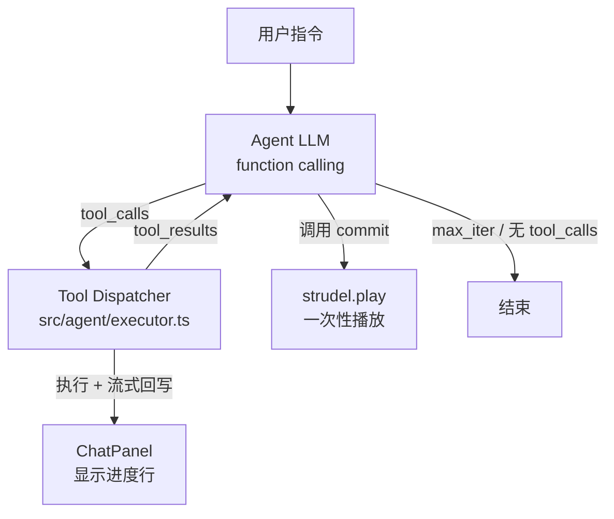

# Agent 模式：Strudel Live-Coding 的工具化升级

## 1. 背景

升级前，`用户指令 → 一次 LLM call → 一份新代码 → 播放` 是单轮 fire-and-forget 模式：LLM 是无状态生成器，没有规划、没有反馈、不能"看见"自己的中间产出，也无法在生成失败时反思重试。

这次改动把生成路径升级为基于 **OpenAI function calling** 的 agent loop：LLM 通过一组细粒度 tool 多步装配 strudel 代码，在 ChatPanel 流式露出每一步进度，最终一次性 hot-reload 播放。

## 2. 核心设计决策

| 决策 | 选项 | 理由 |
|---|---|---|
| 工具方向 | **能力解耦（function calling）** | 让 LLM 自主编排细粒度操作，可解释、可调试 |
| Tool 形态 | **混合：代码操作型 + 1 个意图型 `improvise`** | 既享受确定性骨架编辑的可控性，又保留创造性子任务 |
| 反馈机制 | **弱反馈（语法校验）** | MVP 优先跑通框架，避免"评判员"开销 |
| UX 露出 | **步进式可见（Y 方案）** | ChatPanel 流式显示 tool 调用，音频仍一次 hot-reload，不会因半成品打断听感 |
| Undo 语义 | **1 次 agent loop = 1 个 undo 步** | 中间 tool 不进 undo 栈，撤销体验与经典模式一致 |

## 3. 整体架构



每一次用户指令在 agent 模式下的完整生命周期：

1. App.tsx 接到用户文本 → 调 `runAgent(text, currentCode, onProgress)`
2. `runAgent` 把 OpenAI 客户端包装为 `LLMCaller`，委托给 `runAgentLoop`
3. Loop 反复 `chat.completions.create({ tools, tool_choice: 'auto' })`，把 LLM 返回的 `tool_calls` 路由到 `dispatchToolCall`
4. 每个 tool 执行前后 emit 一个 `ProgressEvent`，App.tsx 把它转成中文进度行追加到 `useChat`
5. LLM 调用 `commit({ code, explanation })` → handler 抛出 `CommitSignal`，loop 捕获后退出
6. App.tsx 用最终代码调一次 `strudel.play()` → 写入 undo 栈、hot-reload 播放、加一条 assistant 解释消息

## 4. Tool 清单（MVP 共 9 个）

### 代码操作型（确定性，纯前端）

| Tool | 作用 |
|---|---|
| `getScore()` | 读当前代码，返回 `{ code, bpm, layers: [{ name, preview }] }` |
| `addLayer({ name, code })` | 加一层进 stack（自动生成 `/* @layer NAME */` 标记） |
| `removeLayer({ name })` | 移除指定层 |
| `replaceLayer({ name, code })` | 整段替换 |
| `applyEffect({ layer, chain })` | 在某层尾追加效果链，如 `.lpf(800).gain(0.7)` |
| `setTempo({ bpm })` | 改 `setcps(...)` 行（cps = bpm / 240） |
| `validate({ code? })` | 用 `new Function()` 做语法校验，**不触音频** |
| `commit({ code?, explanation? })` | 终结 loop，触发 hot-reload + undo 栈写入 |

### 意图型（内部各自一次小 LLM 调用）

| Tool | 作用 |
|---|---|
| `improvise({ role, hints? })` | role ∈ {drums, bass, pad, lead, fx}，返回单层 strudel 片段；agent 拿到后用 addLayer/replaceLayer 装配 |

### Layer 命名约定

代码操作型 tool 在 stack 中用 `/* @layer NAME */` 标记每一层。Parser 识别这个标记把 stack 拆成 `ParsedLayer[]`。如果某层没有标记（比如经典模式生成的代码），自动取名 `layer_0`、`layer_1`……

## 5. 文件改动地图

### 新增

- `src/agent/parser.ts` — 状态机扫描代码，识别 `setcps` / `stack(...)` / 顶层逗号分割 / `/* @layer */` 标记
- `src/agent/tools.ts` — 9 个 tool 的 JSON Schema + handler；`CommitSignal` 终止信号；`getOpenAIToolSchemas()` 导出给 loop
- `src/agent/executor.ts` — 单个 tool_call 的 dispatch + 错误重试（最多 2 次）
- `src/agent/loop.ts` — agent 循环主体，`max_iter=8` / `timeout=120s` 安全网，`onProgress` 事件流

### 改造

| 文件 | 改动 |
|---|---|
| [`src/services/strudel.ts`](../src/services/strudel.ts) | 新增 `validateCode()`，纯 `new Function()` 语法校验，不连音频 |
| [`src/prompts/system-prompt.ts`](../src/prompts/system-prompt.ts) | 新增 `AGENT_SYSTEM_PROMPT`（含 strudel 速查 + tool 用法 + "必须以 commit 结束"硬规则）和 `IMPROVISE_SYSTEM_PROMPT` |
| [`src/services/llm.ts`](../src/services/llm.ts) | 新增 `runAgent()` 入口和内部 `improviseLLM()`；保留 `generateMusic()` 做经典模式降级 |
| [`src/hooks/useChat.ts`](../src/hooks/useChat.ts) | `ChatMessage` 加 `progress` 角色 + `progressKind` / `toolName` / `ok` 字段；新增 `addProgress()` |
| [`src/components/ChatPanel.tsx`](../src/components/ChatPanel.tsx) | `progress` 消息以独立小胶囊渲染（⚙ / ✓ / ✗ / ▶ / ⚠） |
| [`src/App.tsx`](../src/App.tsx) | 头部加经典/Agent 模式切换；agent 模式下 `onProgress` 把事件翻译成中文进度行 |

## 6. 关键技术细节

### Agent Loop 伪代码

```text
runAgentLoop(opts):
  state = { code: initialCode, finalCode: null }
  messages = [system, user(instruction + currentCode)]
  for i in 0..max_iter:
    if elapsed > timeout: warn + break
    resp = llm.chatWithTools(messages, TOOLS)
    push assistant msg (with tool_calls)
    if no tool_calls: break (model done)
    for each call:
      onProgress({ tool_call })
      try outcome = dispatch(call)
      catch CommitSignal: finalCode = signal.code; commit; break outer
      onProgress({ tool_result })
    push tool reply messages
  return { code: finalCode || state.code, explanation, iterations, committed }
```

### `commit` 终止机制

`commit` handler 直接 `throw new CommitSignal(code)`。Loop 在 try/catch 中识别 CommitSignal，写入 finalCode 并 `break outer`。这样：

- 一次 loop 内只能 commit 一次（之后的循环走不到）
- commit 之后的 tool_call 不会被 dispatch
- explanation 从 commit 的 args 中提取（如果有）

### Undo 一致性

| 场景 | 触发 `strudel.play()` 次数 | undo 栈增量 |
|---|---|---|
| 经典模式：一次用户指令 | 1 次 | 1 步 |
| Agent 模式：一次用户指令（含 N 次中间 tool） | 1 次（仅 commit 后） | 1 步 |

中间所有 tool（addLayer、replaceLayer、applyEffect 等）只改 `AgentState.code`（in-memory），不调 `strudel.play()`，所以中间状态不会进入 undo 栈。

### 安全网

- `max_iter = 8`：防止 LLM 死循环
- `timeout = 120s`：防止 tool 卡死；要覆盖含 `improvise` 嵌套 LLM 的多层编曲请求
- 单个 tool 报错最多重试 2 次
- LLM 不调用 commit 就退出时：使用最后一次编辑的 `state.code`，对用户提示 ⚠ 警告
- LLM 一次都没产生有效代码时：保留原 `currentCode`

### DeepSeek function calling

`deepseek-chat` 兼容 OpenAI Chat Completions 的 `tools` / `tool_choice` 字段，现有 `openai` SDK（v6）直接可用，无需新增依赖。如运行时发现稳定性问题，降级路径是把 prompt 改写为"严格 JSON tool_calls schema"由前端解析。

## 7. 进度行渲染规则

为避免噪音，并不是所有 ProgressEvent 都会出现在 ChatPanel：

| 事件 | 是否显示 | 形式 |
|---|---|---|
| `iteration` | 不显示 | （太频繁） |
| `tool_call` | 全部显示 | ⚙ + 中文动作描述（如"加入层 bass"） |
| `tool_result` ok | 仅 `validate` 成功显示 | ✓ "语法校验通过" |
| `tool_result` 失败 | 显示 | ✗ "{name} 失败: {error}" |
| `commit` | 显示 | ▶ "准备播放…" |
| `warn` | 显示 | ⚠ + 警告文本 |
| `assistant_text` | 不作为进度行 | 最终 explanation 用普通 assistant 消息显示 |

## 8. MVP 验收

| 项 | 状态 |
|---|---|
| `npm run build` | 通过 |
| `npm run lint`（新代码） | 0 新增 error / 0 新增 warning |
| 经典模式开关保留可 A/B | ✓ 头部胶囊切换 |
| 一次 loop = 1 个 undo 步 | ✓（设计层保证） |

## 9. 后续可扩展（不在 MVP）

- **中反馈**：加 `evaluateComposition` tool，内部小 LLM 从代码层面评判频段冲突 / 节奏单调
- **强反馈**：利用现有 `Visualizer` / AnalyserNode 加 `listenAndDescribe`，把音频特征结构化喂回 agent
- **段落规划**：加 `improviseTransition({ from, to, bars })` 等过渡 tool
- **意图 tool 降本**：把 improvise 的内部 LLM 切换到更便宜模型（当前复用 deepseek-chat）
- **流式 tool_calls**：当模型支持 stream + tool_calls 时改成边解析边显示，进一步降低首字延迟
