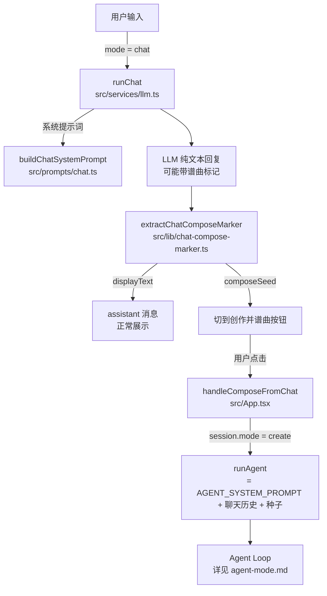

# 聊天模式与"切到创作并谱曲"

## 1. 背景

经典模式 / Agent 模式都是"指令 → 代码 → 播放"的创作闭环，缺少一个**纯聊天**的入口：用户想随便聊聊心情、聊聊故事，而不是每句话都被当成作曲指令、触发 LLM 生成 Strudel 代码。

这次改动新增 **聊天模式（chat）**，与原有的 **创作模式（create）** 并列，由 [`ModeSwitcher`](../src/components/ModeSwitcher.tsx) 在输入框旁切换；并设计了一条"聊天 → 谱曲"的**手动 handoff** 路径：LLM 在聊天中可以提议谱曲，用户点击按钮后才真正进入创作模式生成代码。

## 2. 核心设计决策

| 决策 | 选项 | 理由 |
|---|---|---|
| 聊天模式是否调用工具 / 生成代码 | **否，纯文本对话** | 与创作模式职责彻底分离，避免聊天中误触发代码生成 |
| 谱曲提议的产出形式 | **LLM 自行追加机器可读标记 `[[谱曲: ...]]` / `[[compose: ...]]`** | 不强制每轮聊天都判断"是否该作曲"，由 LLM 按上下文自然决定；标记可被前端正则可靠提取 |
| 聊天 → 创作的触发方式 | **用户手动点击按钮（半自动 handoff）** | LLM 提议但不擅自切换模式，用户保留最终决定权，符合"建议式"产品基调 |
| 创作种子如何生成代码 | **作为本轮 user 指令 + 完整聊天历史一起发给 Agent 模式** | 让创作模式 LLM 感知聊天中建立的情绪/语境，而不是只看一句孤立的种子文本 |
| 模式切换粒度 | **会话级（`session.mode`）** | 每个会话独立记忆当前模式，跨会话切换互不影响 |

## 3. 整体流程



## 4. 关键模块

### 4.1 模式切换 — `ModeSwitcher`

- [`src/components/ModeSwitcher.tsx`](../src/components/ModeSwitcher.tsx)：输入框旁的下拉，`create` / `chat` 两个选项，`Shift+Tab` 快捷切换
- 模式存在 `session.mode` 上（[`src/hooks/useSessions.ts`](../src/hooks/useSessions.ts)），每个会话独立持久化
- [`src/components/TopActionBar.tsx`](../src/components/TopActionBar.tsx) 读取 `session?.mode ?? 'create'` 用于展示/统计

### 4.2 聊天系统提示词 — `buildChatSystemPrompt`

[`src/prompts/chat.ts`](../src/prompts/chat.ts)：

- 按 `detectPromptLanguage()`（是否含中文字符）选择中/英文版本
- 行为约束：跟随用户语言自然回复、可以聊 oddeNova 的故事或用户自己的故事、**不生成 Strudel 代码、不调用工具、不能说"已经开始作曲"**
- 谱曲提议规则：当对话内容适合变成音乐时，可在回复**末尾**追加 `[[谱曲: <一句创作种子>]]`（英文 `[[compose: <seed>]]`）；种子要求"短、具体、可直接作为创作模式指令"；不适合时不输出标记

### 4.3 调用与流式 — `runChat`

[`src/services/llm.ts:382-404`](../src/services/llm.ts#L382-L404)：

```ts
const systemPrompt = buildChatSystemPrompt(instruction);
const messages = [
  { role: 'system', content: systemPrompt },
  ...(conversationHistory ?? []),
  { role: 'user', content: instruction },
];
const resp = await getActiveLLMCaller().chatWithTools(messages, [] /* 不传 tools */, onDelta, undefined, signal);
return { reply: resp.content?.trim() ?? '' };
```

不传 `tools`，复用与 Agent 模式相同的 `LLMCaller.chatWithTools`，但 `tools = []` 等价于普通 chat completion；`onDelta` 仍走流式回调，UI 体验与 Agent 模式一致。

### 4.4 标记解析 — `extractChatComposeMarker`

[`src/lib/chat-compose-marker.ts`](../src/lib/chat-compose-marker.ts)：

```ts
const COMPOSE_MARKER_RE = /(?:\n\s*)?\[\[(?:谱曲|compose)\s*:\s*([^\]]+?)\s*\]\]\s*$/i;
```

- 只匹配回复**末尾**的标记（防止正文中提到"谱曲"被误判）
- 中英文关键字均支持，大小写不敏感
- 返回 `{ displayText, composeSeed }`：`displayText` 是去掉标记后的正文，`composeSeed` 为空/无标记时为 `null`

[`src/App.tsx:390-393`](../src/App.tsx#L390-L393) 接收结果后：

```ts
const parsed = extractChatComposeMarker(result.reply);
sessions.finalizeLastAssistantMessage(parsed.displayText, sessionId, {
  composeSeed: parsed.composeSeed ?? undefined,
});
```

`composeSeed` 存在 `ChatMessage.composeSeed` 字段上（[`src/hooks/useChat.ts`](../src/hooks/useChat.ts)），由 [`src/hooks/useSessions.ts`](../src/hooks/useSessions.ts) 的 `withComposeSeed()` 写入/清理。

### 4.5 UI 入口 — 谱曲建议按钮

[`src/components/ConversationView.tsx:316-328`](../src/components/ConversationView.tsx#L316-L328)：

- 当 assistant 消息带 `composeSeed` 时，在消息下方渲染一个胶囊按钮
- 按钮展示固定文案"切到创作并谱曲"（`t('composeFromChat')`）+ 创作种子原文
- `isLoading` 时禁用，避免会话忙时重复触发

### 4.6 Handoff — `handleComposeFromChat`

[`src/App.tsx:549-561`](../src/App.tsx#L549-L561)：

```ts
const handleComposeFromChat = useCallback(async (seed: string) => {
  const sessionId = sessions.currentId;
  if (!sessionId || loadingSessions.has(sessionId) || abortControllersRef.current.has(sessionId)) return;

  const history = conversationHistoryFromMessages(sessions.currentSession?.messages ?? []);
  sessions.setMode('create', sessionId);
  await handleInstruction(seed, { modeOverride: 'create', history });
}, [...]);
```

- 把当前会话**全部聊天消息**转成 `ConversationTurn[]` 历史
- 把会话模式持久化切换为 `create`（之后该会话默认走创作模式）
- 用 `modeOverride: 'create'` 强制本轮走创作分支，避免 `mode` state 异步更新导致的时序问题

### 4.7 创作模式消费历史 — `runAgent` → `runAgentLoop`

[`src/services/llm.ts:406-447`](../src/services/llm.ts#L406-L447) 的 `runAgent` 把 `conversationHistory` 透传给 [`src/agent/loop.ts`](../src/agent/loop.ts)：

```ts
const messages = [
  { role: 'system', content: systemPrompt },   // AGENT_SYSTEM_PROMPT
  ...(conversationHistory ?? []),               // 聊天模式产生的全部历史
  { role: 'user', content: userTurn },          // = composeSeed
];
```

即最终发给创作 Agent 的不只是"创作种子"一句话，而是**创作系统提示词 + 完整聊天上下文 + 种子作为本轮指令**，让代码生成结果能呼应聊天中建立的情绪、画面或故事。后续的 tool 调用 / commit / undo 行为与经典 Agent 模式一致，详见 [agent-mode.md](./agent-mode.md)。

## 5. 文件改动地图

### 新增

- `src/prompts/chat.ts` — `buildChatSystemPrompt()` / `detectPromptLanguage()`
- `src/lib/chat-compose-marker.ts` — `extractChatComposeMarker()`
- `src/components/ModeSwitcher.tsx` — 创作/聊天模式下拉切换

### 改造

| 文件 | 改动 |
|---|---|
| [`src/services/llm.ts`](../src/services/llm.ts) | 新增 `runChat()`，不挂 tools 的纯文本对话入口 |
| [`src/hooks/useChat.ts`](../src/hooks/useChat.ts) | `ChatMessage` 新增 `composeSeed?: string` 字段 |
| [`src/hooks/useSessions.ts`](../src/hooks/useSessions.ts) | 新增 `withComposeSeed()`；`session.mode` 持久化；`finalizeLastAssistantMessage` 支持写入 `composeSeed` |
| [`src/components/ConversationView.tsx`](../src/components/ConversationView.tsx) | 渲染"切到创作并谱曲"按钮，回调 `onComposeFromChat` |
| [`src/components/ChatInput.tsx`](../src/components/ChatInput.tsx) | 接入 `ModeSwitcher`，透传 `mode` / `onModeChange` |
| [`src/components/Sidebar.tsx`](../src/components/Sidebar.tsx) | 透传 `onComposeFromChat` |
| [`src/App.tsx`](../src/App.tsx) | `handleInstruction` 按 `mode` 分流到 `runChat` / `runAgent`；新增 `handleComposeFromChat` |
| [`src/lib/i18n.ts`](../src/lib/i18n.ts) | 新增 `modeCreate` / `modeChat` / `modeCreateDesc` / `modeChatDesc` / `composeFromChat` 等文案 |

## 6. 边界情况

- **标记缺失/格式错误**：`extractChatComposeMarker` 返回 `composeSeed: null`，不渲染按钮，正文原样展示
- **会话忙碌时点击按钮**：`handleComposeFromChat` 检查 `loadingSessions` / `abortControllersRef`，忙碌中直接 return
- **聊天模式中途中断（abort）**：与创作模式一致，回复替换为 `t('interrupted')`，不解析 compose 标记
- **聊天历史很长**：聊天模式与创作模式共用同一份 `conversationHistoryFromMessages()`，未做额外裁剪——如后续遇到 token 超限，可在此处按轮数/字数截断
