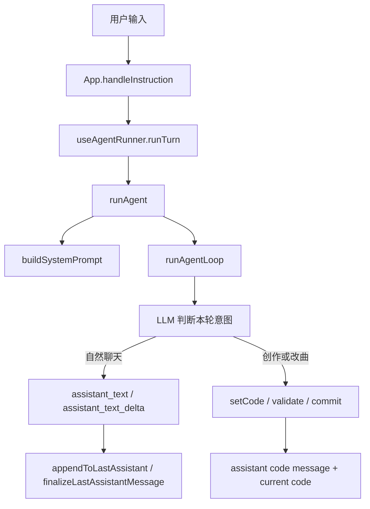

# 统一 Agent 对话模式

## 1. 背景

早期设计把用户输入分成独立的 `chat` / `create` 两种模式：纯聊天走单独的文本 pipeline，作曲走 Agent 工具 pipeline，并通过手动 UI 在两者之间切换。统一 Agent 模式取消这条分叉：每条用户消息都进入同一个 Agent loop，由模型逐条判断是自然聊天，还是调用工具创作或修改 Strudel 音乐。

这样做的目标是减少 UI 和状态复杂度，同时保留两种体验：

- 用户想聊天时，模型直接回复文本，不调用 `setCode`、`validate` 或 `commit`。
- 用户想要音乐或修改当前曲子时，模型调用工具生成、校验并提交代码。

## 2. 核心设计决策

| 决策 | 当前方案 | 理由 |
|---|---|---|
| 入口 | 所有文本输入统一走 `runAgent` / `runAgentLoop` | 避免 `runChat` 与 Agent loop 分别维护流式、取消、历史和错误处理 |
| 聊天意图 | 模型自然回复，不调用工具 | 纯聊天不产生代码，也不触发播放 |
| 作曲意图 | 模型调用工具，并以一次 `commit` 结束 | 维持现有 Agent 作曲闭环，确保用户能看到结果 |
| 模式状态 | 不再持久化 `session.mode` | 会话不需要记住手动模式，每条消息独立判断 |
| 聊天到作曲 | 不再使用 `[[谱曲:]]` / `[[compose:]]` 标记或按钮 handoff | 模型可以在后续用户明确要作曲时直接使用完整会话历史作曲 |
| 分享与存储 | Session/share payload 不再携带 mode | 旧 session 里的 legacy `mode` 字段在读取时忽略 |

## 3. 整体流程

## 4. 关键模块

### 4.1 输入与运行

- [`src/App.tsx`](../../src/App.tsx) 的 `handleInstruction` 不再按 mode 分流，所有消息都调用 `runTurn`。
- [`src/hooks/useAgentRunner.ts`](../../src/hooks/useAgentRunner.ts) 负责添加用户消息、构造历史、调用 `runAgent`、处理取消和错误。
- [`src/services/llm.ts`](../../src/services/llm.ts) 只保留 `runAgent`。旧的 `runChat`、chat-only prompt 和 compose-marker bridge 已删除。

### 4.2 Agent loop 的两种合法结果

[`src/agent/loop.ts`](../../src/agent/loop.ts) 支持同一轮里两种成功形态：

- 工具路径：模型调用 `setCode`、`validate`、`commit`，返回带代码的 `RunAgentResult`。
- 纯文本路径：模型返回 assistant text 且没有工具调用，`RunAgentResult.code` 为空字符串；调用方据此只保留聊天文本，不重放旧代码。

纯聊天时即使当前 session 已有 `code`，结果也必须保持 `code === ''`，避免把未变化的旧代码当成新提交。

### 4.3 流式文本归档

Agent 进度事件统一写入 session：

- `assistant_text_delta` → `sessions.appendToLastAssistant`
- `assistant_text` → `sessions.finalizeLastAssistantMessage`
- `reasoning_delta` → `sessions.appendToLastReasoning`
- `tool_call` / `commit` / `warn` 维持原有进度与提交展示

[`applyFinalizeLastAssistantMessage`](../../src/hooks/useSessions.ts) 只会覆盖最后一条不带 `code` 的 assistant 文本消息；如果最后一条 assistant 带有 `code`，会追加新的 assistant 文本消息，避免覆盖作曲结果。

### 4.4 Session、分享与 legacy 数据

- [`src/hooks/useChat.ts`](../../src/hooks/useChat.ts) 只定义 `ChatMessage` / role / progress kind。
- [`src/hooks/useSessions.ts`](../../src/hooks/useSessions.ts) 的 `Session` 不含 `mode`，也不含 compose seed handoff 状态。
- [`src/lib/session-storage.ts`](../../src/lib/session-storage.ts) 读取旧记录时会丢弃 legacy `mode` 字段。
- [`src/services/share.ts`](../../src/services/share.ts) 上传 payload 不再包含 mode。

## 5. 已删除的旧路径

以下模块不再存在，也不应重新引入：

- `src/services/llm.ts#runChat`
- `src/prompts/chat.ts`
- `src/lib/chat-compose-marker.ts`
- `src/components/ModeSwitcher.tsx`
- `ChatMessage.composeSeed`
- `Session.mode`
- `[[谱曲: ...]]` / `[[compose: ...]]` handoff 标记

## 6. 边界情况

- **纯聊天没有代码**：如果模型只回复文本且没有工具调用，UI 只显示 assistant 文本。
- **当前已有代码时纯聊天**：不会重新提交或播放旧代码。
- **作曲后继续聊天**：下一条消息仍进入 Agent loop；模型可根据用户意图选择聊天或继续改曲。
- **legacy session mode**：旧存储中的 `mode` 会在读取时忽略，不再写回。
- **中断或失败**：取消、错误、loading session 清理都由统一 `runTurn` 路径处理。
