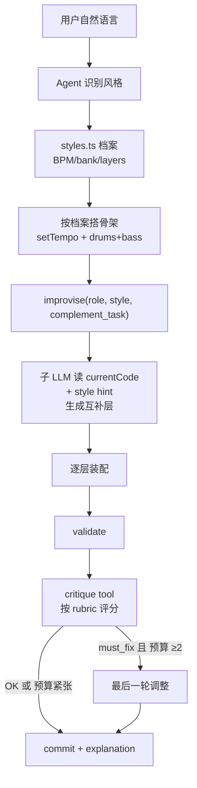

# 提示词音乐性升级（A + B + C）

**日期**：2026-04-22
**作者**：AI 协作产出
**状态**：已批准，待实现

---

## 背景与现状

当前 [docs/prompts.md](../../prompts.md) 收录的三套 prompt（`AGENT_SYSTEM_PROMPT` / `IMPROVISE_SYSTEM_PROMPT` / `SUGGEST_SYSTEM`）几乎全是语法/工程约束（"不要写 setcps"、"必须 commit"、"禁止 TidalCycles API"），**完全没有任何"如何把曲子写得好听"的指引**。

这导致模型容易产出「语法正确但听感像练习题」的结果——所有层都在一个八度内堆叠、密度都拉满、没有任何对比。

同时审查代码时发现几个一致性 bug：

- [src/agent/tools.ts](../../../src/agent/tools.ts) 中 `improvise` tool 的 `role` enum 缺 `hh`，但主 prompt 把 `hh` 列为推荐层名。
- TidalCycles 警告在 cheatsheet、improvise prompt、validate 错误信息三处重复。
- `improvise` 已经把 `currentCode` 传给子模型，但 `IMPROVISE_SYSTEM_PROMPT` 完全没让模型"基于 currentCode 互补"，上下文白传。
- `commit.explanation` 字段存在但 prompt 不提，模型从不填。

## 目标

让 agent 生成的曲子从"语法正确"升级到"有编曲意识"，体现在：

- 层次顺序合理（先骨架后色彩）
- 频段不冲突（kick / bass / pad / lead / hh 各占其位）
- 密度有对比（不是所有层都满拍）
- 调性一致（统一 scale）
- gain 平衡（不爆音、不糊在一起）

## 非目标

- few-shot 优秀作品库（D1/D2 方案）：等 A+B+C 跑一段时间后再收集"跑出来的好作品"，下一轮迭代加入。
- 切换 LLM 模型 / 改架构。
- `SUGGEST_SYSTEM` 优化（与音乐性目标弱相关）。

---

## 方案：A + B + C 三层叠加

### A. 音乐性原则注入（纯 prompt 改动）

在 [src/prompts/system-prompt.ts](../../../src/prompts/system-prompt.ts) 的 `AGENT_SYSTEM_PROMPT` 中新增 `## Musicality principles` 节，写 5 条硬规则：

1. **层次顺序**：drums → bass → pad/lead → fx，禁止一上来全是和声层。
2. **频段分工**：kick<100Hz、bass 用 c2-g2、pad/lead 用 c4 以上、hh 高频；同八度禁止两个 sustain 类层叠加。
3. **密度对比**：≥4 层时至少 1 层用 `.mask("<1 0 1 1>/4")` 或 `.struct(...)` 留白。
4. **调性一致性**：第一个旋律层确定 key 后，后续层沿用同一 `.scale(...)`。
5. **gain 平衡**：drums 0.7-0.9 / bass 0.6-0.8 / pad 0.3-0.5 / lead 0.4-0.6 / fx 0.3-0.5。

同时修复一致性 bug：

- `improvise` tool schema 的 `role` enum 加 `hh`。
- 删 cheatsheet 里冗余的 TidalCycles 长警告（保留 validate 错误信息中的提示）。
- `commit.explanation` 在 prompt 中改为「必填，1 句中文说明改了什么」。

### B. 风格预设库（新增文件 + tool schema 调整）

新建 `src/prompts/styles.ts`，定义 6 个风格档案（lofi / house / dnb / ambient / techno / synthwave），每条结构：

```ts
{
  id: 'lofi',
  match: ['lo-fi', 'lofi', '慢节奏', '安静', '夜晚', '学习'],
  bpm: [70, 90],
  bank: 'RolandTR808',
  layers: ['drums', 'bass', 'pad'],
  hint_for_improvise: {
    bass: 'walking bass, sparse',
    pad: 'warm Rhodes-like, slow attack',
  },
}
```

> **注意**：根据 brainstorming 决定，**不在档案里塞 skeleton 代码**——避免锁死风格、丧失多样性。

`AGENT_SYSTEM_PROMPT` 新增 `## Style matching` 节：列出 6 个风格关键词，要求 "从用户描述中匹配最近的一个 → 用其 BPM/bank 作为起点；匹配不到则自由发挥"。

`improvise` tool schema 新增可选 `style` 字段（enum 同上）+ `complement_task` 字段（自由文本，描述这个层要互补什么，如 `"高频节奏点缀，避开 kick 拍位"`）。handler 把对应 style 的 `hint_for_improvise[role]` 拼到子模型 user prompt 里。

`IMPROVISE_SYSTEM_PROMPT` 改造：明确 "必须分析 currentCode 中的 BPM/key/已有层 → 生成与其互补的片段"。**不增加 few-shot**，仅改提示词措辞。

### C. Critique 评审轮（新增 tool + 子 prompt）

- 在 [src/prompts/system-prompt.ts](../../../src/prompts/system-prompt.ts) 新增 `CRITIC_SYSTEM_PROMPT` 导出。
- 新增 `critique` tool（无参数，handler 调用子 LLM），子模型按 rubric 评分：
  - 层次完整性（缺 drums/bass 直接扣分）
  - 频段分布（多个 sustain 层撞频）
  - 密度对比（≥4 层无 mask/struct 扣 2 分）
  - 调性一致性
  - gain 平衡
  - 输出 JSON `{ score: 0-10, suggestion: "..." | null, must_fix: bool }`
- `AGENT_SYSTEM_PROMPT` 工作流改为：`validate` 通过 → 调一次 `critique` → 若 `must_fix=true` 且预算 ≥2 轮，按 suggestion 改一层再 commit；否则直接 commit。
- 轮次预算从 12 提到 14。
- **防自循环**：`critique` 一次 session 最多调 1 次（在 `AgentState` 加 `critiqued: boolean` 标志位强制）。

---

## 整体调用链



---

## 文件变动清单

- **改** [src/prompts/system-prompt.ts](../../../src/prompts/system-prompt.ts)：A 的原则注入 + B 的 style matching 节 + C 的 critic 子 prompt 导出 + commit.explanation 强化
- **改** [src/services/llm.ts](../../../src/services/llm.ts)：新增 `critiqueLLM` 函数（仿 `improviseLLM` 兜底机制）；改 `improviseLLM` 把 style/complement_task 拼进 user prompt
- **改** [src/agent/tools.ts](../../../src/agent/tools.ts)：improvise schema 加 style/complement_task 字段；新增 critique tool；修 enum 加 hh；commit.explanation 描述强化；`AgentState` 加 `critiqued: boolean` 标志
- **改** [src/agent/loop.ts](../../../src/agent/loop.ts)：轮次预算 12→14；`ToolContext` 增加 `critiqueLLM` 字段；初始化 `state.critiqued = false`
- **新增** `src/prompts/styles.ts`：6 个风格档案 + `matchStyle(userText)` 工具函数
- **改** [docs/prompts.md](../../prompts.md)：同步所有 prompt 变更，新增 critic 章节，更新调用关系图

---

## 风险与缓解

- **Critic 主观性飘**：rubric 写死量化指标（"≥4 层无 mask/struct 扣 2 分"），强制只输出 1 条建议，且每 session 最多调 1 次。
- **轮次膨胀 17%**：critique 可被 agent 主动跳过；prompt 中明确"已经满意就直接 commit"。
- **风格匹配失败**：match 函数支持 fallback 到 ambient；prompt 允许"无匹配则自由发挥"。
- **prompt 膨胀**：B 的风格档案详情放在 tool description（按需加载），system prompt 只放关键词列表。
- **Critic 与 Validate 冲突**：critique 只评音乐性不查语法，rubric 中明确不重复 validate 的工作。
