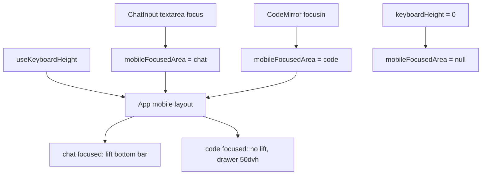

# 移动端代码编辑键盘布局设计规范

**日期：** 2026-06-06  
**状态：** 设计已确认，等待书面 spec 复核  
**范围：** 移动端代码抽屉、代码编辑聚焦、底部聊天输入框键盘避让

---

## 背景

移动端打开代码抽屉后，点击代码编辑器会唤起软键盘。当前移动端底部栏在任何键盘弹出场景都会执行：

```tsx
transform: keyboardHeight > 0 ? `translateY(-${keyboardHeight}px)` : undefined
```

这会让聊天输入框上移，覆盖代码抽屉。截图中可见：代码抽屉本身只有约 `33dvh`，聊天输入框又叠到代码区上方，导致代码可读和可编辑空间都很小。

用户确认的期望行为：**点击代码部分时，对话框位置不动，允许它隐藏在键盘底下；不要让聊天框上移遮挡代码。**

---

## 目标

1. 点击聊天输入框时，保留现有键盘避让：聊天框上移，用户能看见正在输入的内容。
2. 点击代码编辑器时，底部聊天框不随键盘上移，允许被软键盘遮住。
3. 代码编辑器聚焦时，代码抽屉变高，提升可编辑空间。
4. 桌面端布局和行为不变。

---

## 已比较方案

| 方案 | 内容 | 结论 |
|------|------|------|
| A 保守修错 | 只修 `keyboardHeight` 计算和底部栏位移，避免错位 | 改动小，但代码框仍偏小 |
| B 编辑态优先 | 区分聊天聚焦和代码聚焦；代码聚焦时底部栏不避让键盘，抽屉加高 | 采纳 |
| C 全屏代码编辑 | 代码编辑进入全屏 sheet，聊天暂退后台 | 编辑体验最好，但改动和状态设计成本更高 |

最终采用 **B+：编辑态优先 + 点击代码时聊天框不动**。

---

## 交互规则

### 聊天输入聚焦

- `mobileFocusedArea = 'chat'`
- 底部栏按当前键盘高度上移：

```tsx
transform: keyboardHeight > 0 ? `translateY(-${keyboardHeight}px)` : undefined
```

- 建议 chips 和聊天输入框保持现有行为。

### 代码编辑器聚焦

- `mobileFocusedArea = 'code'`
- 底部栏不执行键盘避让：

```tsx
transform: undefined
```

- 聊天输入框保持在原始底部位置，软键盘弹出后可以覆盖它。
- 建议 chips 隐藏，避免占用竖向空间。
- 代码抽屉高度从普通打开态的 `33dvh` 提升到约 `50dvh`。

### 失焦或键盘收起

- 失焦时清空对应聚焦状态。
- 键盘高度回到 `0` 时，`mobileFocusedArea` 可恢复为 `null`。
- 代码抽屉仍打开时回到普通 `33dvh` 高度。

---

## 组件设计

### `src/App.tsx`

新增状态：

```ts
const [mobileFocusedArea, setMobileFocusedArea] =
  useState<'chat' | 'code' | null>(null);
```

移动端底部栏位移逻辑改为只响应聊天聚焦：

```tsx
const shouldLiftBottomBar =
  mobileFocusedArea === 'chat' && keyboardHeight > 0;
```

代码抽屉高度：

```tsx
const mobileDrawerHeight = !drawerOpen
  ? 0
  : mobileFocusedArea === 'code'
    ? '50dvh'
    : '33dvh';
```

移动端建议 chips 渲染条件增加：

```tsx
mobileFocusedArea !== 'code'
```

传给子组件：

```tsx
<CodePanel onEditorFocusChange={(focused) => {
  setMobileFocusedArea(focused ? 'code' : null);
}} />

<ChatInput onFocusChange={(focused) => {
  setMobileFocusedArea(focused ? 'chat' : null);
}} />
```

若 `keyboardHeight === 0`，用 effect 清空 `mobileFocusedArea`，避免软键盘关闭后保留编辑态高度。

### `src/components/ChatInput.tsx`

新增可选 prop：

```ts
onFocusChange?: (focused: boolean) => void;
```

绑定 textarea：

```tsx
onFocus={() => onFocusChange?.(true)}
onBlur={() => onFocusChange?.(false)}
```

保持现有自动高度、发送、停止、replay 行为不变。

### `src/components/CodePanel.tsx`

新增可选 prop：

```ts
onEditorFocusChange?: (focused: boolean) => void;
```

在 `containerRef` 所在编辑器容器上监听 `focusin` / `focusout`：

- `focusin`：通知父级进入 `code` 聚焦态。
- `focusout`：用短延迟或 `relatedTarget` 判断焦点是否仍在 CodeMirror 容器内；若不在，通知父级退出 `code` 聚焦态。

这避免点击代码区内部子节点时频繁抖动。

---

## 数据流



---

## Error Handling And Edge Cases

- 浏览器不支持 `visualViewport`：`useKeyboardHeight()` 继续返回 `0`，不引入新失败模式。
- `focusout` 在 CodeMirror 内部节点间切换：通过 `relatedTarget` 或短延迟检查容器包含关系，避免误退出。
- 用户点击代码后再点击聊天输入：`ChatInput` focus 会覆盖状态为 `chat`，底部栏恢复键盘避让。
- 用户收起键盘但代码抽屉仍打开：`keyboardHeight === 0` 后状态清空，抽屉回普通高度。
- 桌面端不使用移动端分支；新增 props 可选，不影响桌面布局。

---

## 测试计划

### 单元或组件测试

- `ChatInput` 聚焦时调用 `onFocusChange(true)`，失焦时调用 `onFocusChange(false)`。
- `CodePanel` 容器收到 `focusin` 时调用 `onEditorFocusChange(true)`；焦点离开容器后调用 `false`。

### 手动验证

1. 移动端点聊天输入：聊天输入框上移避开键盘。
2. 移动端打开代码抽屉后点代码：聊天输入框不上移，不遮挡代码。
3. 代码编辑聚焦时：抽屉高度约 `50dvh`，代码区明显比当前更大。
4. 代码编辑聚焦时：建议 chips 隐藏，播放/Volume/BPM/LPF 控制仍可见。
5. 从代码编辑切回聊天输入：底部栏重新避开键盘。
6. 桌面端布局和拖拽分栏无变化。

### 命令

```bash
npm run lint
npm test -- --run src/components/__tests__/ChatInput.test.tsx
```

若实现改动触及更多行为，再运行：

```bash
npm test
```

---

## 不在本次范围内

- 全屏代码编辑 sheet。
- 新增代码保存/取消流程。
- 重做移动端聊天布局。
- 修改 Strudel/CodeMirror 编辑器主题。
- 改动桌面端 `CodePanel` 尺寸或拖拽逻辑。
